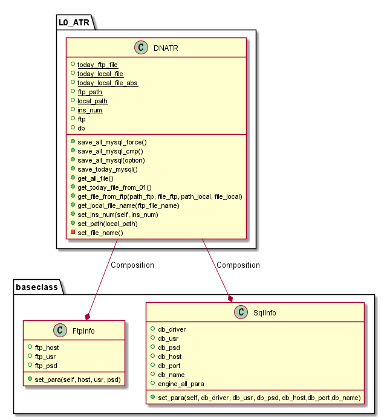

# L0_ATR



## 使用

### 用来比较FTP与MySQL里面的文件更新MySQl里面数据
```python
import L0_ATR
dn_atr = L0_ATR.DNATR()
dn_atr.get_all_file()
dn_atr.save_all_mysql()
```

### 用来读取当天数据存入MySQL
```python
import L0_ATR
dn_atr = L0_ATR.DNATR()
dn_atr.get_today_file_from_01()
dn_atr.save_today_mysql()
```

## 设置
当前设想为每天更新当天的，每月更新是否遗漏
